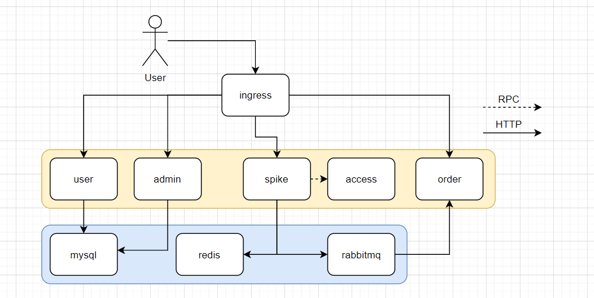

# golang秒杀系统后端

## 架构设计

### 微服务划分



* 用户(user)
  * 登录
  * 注册
  * 刷新token
  
* 秒杀(spike)
  * 核心的秒杀逻辑
  * 将订单减扣的消息发送到消息队列
  
* 准入(access)
  * 对指定的秒杀，根据灵活的规则配置来判断用户是否有资格

* 管理(admin)
  * 管理秒杀活动(CRUD)

* 订单(order)
  * 查询订单
  * 付款
  * 接收消息队列的消息，生成订单插入数据库


```bash
docker build --target access -t access-server:0.0.1 .
docker build --target spike -t spike-server:0.0.1 .
docker build --target user -t user-server:0.0.1 . 
docker build --target admin -t admin-server:0.0.1 . 
docker build --target order -t order-server:0.0.1 . 
```


## TODO

- [ ] 前端简易UI

- [ ] 并发测试程序

- [x] 针对用户id，访问接口频率限流

  代码位置：插入 spike的`getRandHandler`和`spikeHandler`函数前

  当用户在一秒内访问了n次(比如10，可配置)以上时，直接返回429，最好通过redis实现

- [x] 针对ip限流，通过nginx-ingress配置完成

- [x] 针对用户请求量限流，n倍以上时直接抛弃请求

  代码位置：spike `spikeHandler`

  若秒杀商品量为k，k之后的请求其实毫无意义，直接返回sold out

  此处的逻辑需要设计，保证商品在未买完的情况下，不会拒绝请求，可以将`getRestStock`库存判断提前到access之前

- [ ] 订单已存在情况判断

  代码位置：spike `spikeHandler`

- [ ] admin，秒杀活动CRUD

- [ ] 增加access缓存层

  代码位置：access `IsAccessible`

  增加redis缓存，暂存用户在某个活动的准入评测结果，缓存时间要设置的稍短(30s?待测试)

- [x] 订单操作

  * 取消
  * 查看订单详情
  * 付款
  
  注意同步redis数据


  

  